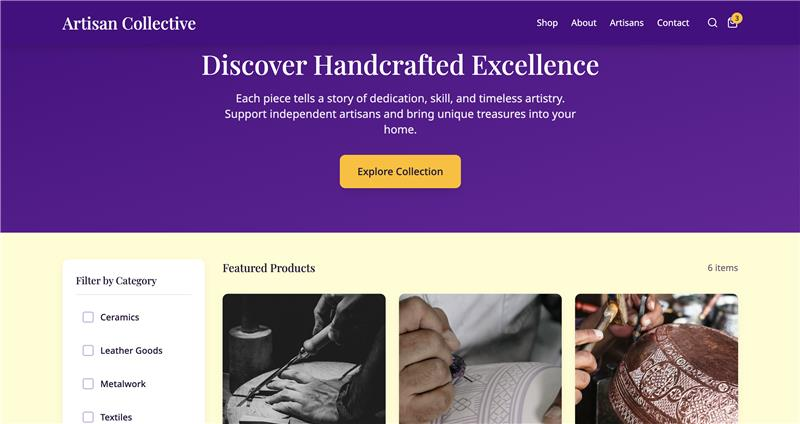

# Handcrafted Haven

Handcrafted Haven is a virtual marketplace designed to connect talented artisans with customers who appreciate unique, high-quality handmade products. This application fosters a sense of community while promoting sustainable consumption and supporting local creators.

## Group Members (Team 01)

- Raphael Eferire Daveal (Week 02 Group Lead)
- Enrique Alberto Ibarra Cuanalo
- Hann Dowyne Valcourt
- Isaac Hooper
- Porter Luke Frazier (Week 03 Group Lead)
- Lehi Nyakno Daniel
- Christiana Nwachukwu
- Kamohelo Godfrey Mejaele

## Project Goals

- **Seller Profiles**: Enable artisans to showcase craftsmanship and share their stories.
- **Product Listings**: Allow for curated item displays with descriptions, pricing, and images.
- **Search & Filter**: Provide users with an intuitive way to browse the catalog by category or price.
- **Reviews & Ratings**: Implement a feedback system for community engagement.

## Technology Stack

- **Front-End**: Next.js (React), Tailwind CSS
- **Back-End**: Node.js, Database
- **Project Management**: GitHub Boards
- **Deployment**: Vercel

You can check out [the Next.js GitHub repository](https://github.com/vercel/next.js) - your feedback and contributions are welcome!

## Deploy on Vercel

Vercel App Link: https://handcrafted-haven-ivory-three.vercel.app/

The easiest way to deploy your Next.js app is to use the [Vercel Platform](https://vercel.com/new?utm_medium=default-template&filter=next.js&utm_source=create-next-app&utm_campaign=create-next-app-readme) from the creators of Next.js.

Check out our [Next.js deployment documentation](https://nextjs.org/docs/app/building-your-application/deploying) for more details.

## Branding
The primary color is Deep Plum - #4B0082, the background is Soft Cream - #FFFDD0 and the accent is Amber - #FFBF00. The heading font is Playfair Display and Serif as the backup, the body is Noto Sans with Sans-Serif as the backup. The UI should have a responsive grid designs with modals and cards includings soft subtle shadows.

### Mobile View
Should have grids or columns collapse into single column views.
Should have mobile friendly versions of images with wide aspect ratios.

## Getting Started

1. Clone the repository: `git clone https://github.com/Daveralphy/handcrafted-haven.git`
2. Install dependencies: `npm install`
3. Run the development server: `npm run dev`
